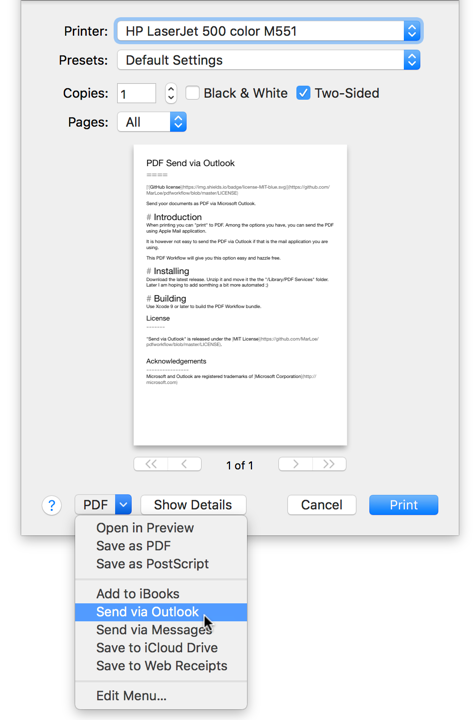

PDF Send via Outlook
====

Send your documents as PDF via Microsoft Outlook.

# Introduction
On macOS you can "print" to PDF. Among the options you have, is sending the print as PDF using Apple Mail application.

It is however not easy to send the PDF via Outlook if that is the mail application you are using.

This PDF Workflow will give you this option easy and hazzle free. It create a new mail message in Outlook and add the PDF document as an attachment. The subject will be the file name of your generated PDF document. Some applications is known to generate the PDF with the filename "Untitled.pdf" - I have no influence on this :(.

# Installing
Download SendViaOutlook.zip from the [latest release](https://github.com/MarLoe/pdfworkflow/releases/latest). Unzip it and move it to the "/Library/PDF Services" folder.

Later I am hoping to add somthing a bit more automated ;)

# Building
Use Xcode 9 or later to build the PDF Workflow bundle.

License
-------

"Send via Outlook" is released under the [MIT License](https://github.com/MarLoe/pdfworkflow/blob/master/LICENSE).

Acknowledgements
----------------
Apple and macOS are registered trademarks of [Apple Inc.](http://apple.com)

Microsoft and Outlook are registered trademarks of [Microsoft Corporation](http://microsoft.com)

PDF is a registered trademark of [Adobe Systems Incorporated](http://adobe.com)
