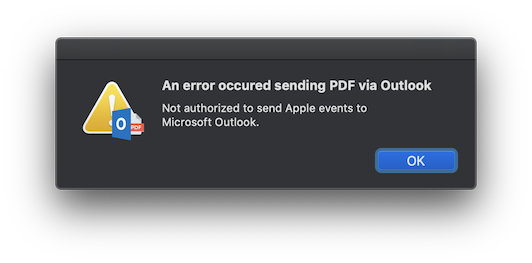

#  PDF Send via Outlook

Send your documents as PDF via Microsoft Outlook.

## Introduction

On MacOS you can "print" to PDF. Among the options you have, is sending the print as PDF using Apple Mail application.

It is however not easy to send the PDF via Microsoft Outlook if that is the mail application you are using.

This PDF Workflow will give you this option easy and hazzle free. It creates a new mail message in Microsoft Outlook and add the PDF document as an attachment. The subject will be the file name of your generated PDF document. Some applications is known to generate the PDF with the filename "Untitled.pdf" - I have no influence on this :(.

 

## Installing

Download "Send via Outlook.pkg" from the [latest release](https://github.com/MarLoe/pdfworkflow/releases/latest). Run the installer and you are good to go. The "Send via Outlook.pdfworkflow" will be installed in the "/Library/PDF Services" folder and be available for all users on your machine.

If you are running on macOS Mojave (10.14) or later, the first time you use it, you will be presented with this 
If this is not the case, please read the [User Data Protection](#user-data-protection) section.

## Building

Use Xcode 9 or later to build the PDF Workflow bundle.

## User Data Protection

Introduced in macOS Mojave 10.14 is an improved user data protection requiring the users permission for a lot more operation.
This also affects this tool.
If you see the error message "Not authorized to send Apple events to Microsoft Outlook."  you must install the latest release. If you have the latest release, you might need to reset the permissions, in order to accept them again. This can be done by running this command from the Terminal.app

    tccutil reset AppleEvents

## License

"Send via Outlook" is released under the [MIT License](https://github.com/MarLoe/pdfworkflow/blob/master/LICENSE).

## Acknowledgements

[Packages Application](https://github.com/packagesdev/packages) by Stephane Sudre - [s.sudre.free.fr](http://s.sudre.free.fr/Software/Packages/about.html)

Apple and macOS are registered trademarks of [Apple Inc.](http://apple.com)

Microsoft and Outlook are registered trademarks of [Microsoft Corporation](http://microsoft.com)

PDF is a registered trademark of [Adobe Systems Incorporated](http://adobe.com)
